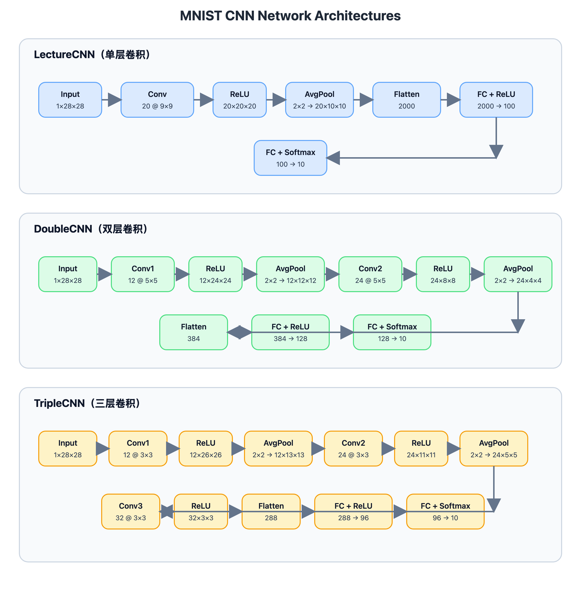
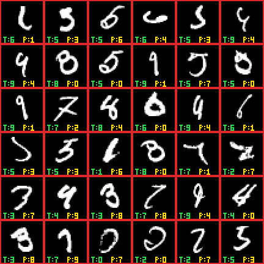
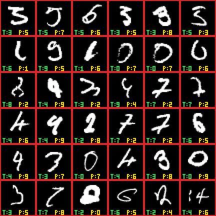

# 基于纯 NumPy 的 MNIST 手写数字识别实验报告

## 1. 实验目的

本实验基于 MNIST 手写数字数据集，使用纯 NumPy 从零实现卷积神经网络（CNN）的前向传播、反向传播和 mini-batch SGD 训练，并围绕以下两个目标开展结构设计与调参：

- 在满足作业要求约束的前提下，尽量降低模型参数量；
- 在更低参数量条件下，尽量提升识别精度。

本文重点包括：

- 双层 CNN、三层 CNN 模型设计与实现；
- 围绕双层/三层 CNN 的两轮调参实验；
- 与单层主模型 `LectureCNN` 和轻量对照模型 `SimpleCNN` 的系统比较；
- 对“参数量、精度、训练时间”三者关系的分析与结论。

## 2. 实验环境

### 2.1 硬件环境


| 项目 | 配置 |
| --- | --- |
| 设备型号 | MacBook Air |
| 芯片 | Apple M5 |
| CPU 核心 | 10 核（4 Performance + 6 Efficiency） |
| 内存 | 16 GB |
| 架构 | arm64 |


### 2.2 软件环境

| 项目 | 版本 |
| --- | --- |
| 操作系统 | macOS 26.4.1 |
| Python | 3.13.13 |
| NumPy | 2.4.6 |
| SciPy | 1.17.1 |


## 3. 数据集与预处理

实验数据来自 `data/MNISTData(1).mat`：

- 训练集：60000 张 `28×28` 灰度图像；
- 测试集：10000 张 `28×28` 灰度图像；
- 加载后格式统一转换为 `NCHW`，即 `X.shape = (N, 1, 28, 28)`；
- 像素值范围为 `[0, 1]`。

一个关键修正点在 `data.py` 中：原始 one-hot 标签的行顺序并不是自然数字 `0~9`，而是 `1,2,3,...,9,0`。如果直接 `argmax` 会导致标签整体错位，因此代码通过映射把类别索引重新转换为自然数字标签。这一步保证了训练、可视化和误分类分析的正确性。

## 4. 模型设计

### 4.1 三种主模型

本项目实现了 4 个模型，本文重点比较以下 3 类：

- `LectureCNN`：单层卷积模型；
- `DoubleCNN`：双层卷积模型；
- `TripleCNN`：三层卷积模型。

### 4.2 网络架构图



图 1 展示了 `LectureCNN`、`DoubleCNN` 和 `TripleCNN` 的整体网络结构、主要层次以及特征图尺寸变化。

### 4.3 参数量对比

| 模型 | 卷积层数 | 展平维度 | 权值数（不含 bias） | 可训练参数（含 bias） |
| --- | --- | --- | --- | --- |
| LectureCNN | 1 | 2000 | 202620 | 202750 |
| DoubleCNN | 2 | 384 | 57932 | 58106 |
| TripleCNN | 3 | 288 | 38220 | 38394 |

可学习参数量计算如下：

- `LectureCNN`：`9×9×20 + 2000×100 + 100×10 = 202620`
- `DoubleCNN`：`5×5×12 + 5×5×12×24 + 384×128 + 128×10 = 57932`
- `TripleCNN`：`3×3×12 + 3×3×12×24 + 3×3×24×32 + 288×96 + 96×10 = 38220`

可以看出，更深的卷积堆叠显著缩小了展平后的特征向量维度，从而大幅减少了全连接层参数量：

- `DoubleCNN` 参数量仅为 `LectureCNN` 的 `28.66%`；
- `TripleCNN` 参数量仅为 `LectureCNN` 的 `18.94%`。

## 5. 代码实现中的关键 Tricks

### 5.1 `im2col / col2im` 向量化卷积与池化

`layers.py` 中的卷积和平均池化并没有直接使用多重 Python 循环，而是通过 `im2col` 和 `col2im` 将局部区域展开为矩阵，再把运算转化为矩阵乘法。这是纯 NumPy 实现下最重要的效率优化手段之一。

### 5.2 He 初始化

卷积层与全连接层默认使用 He 初始化：

```python
weight_scale = np.sqrt(2.0 / fan_in)
```

这与 ReLU 更匹配，能加快训练初期收敛并减少梯度过小问题。

### 5.3 数值稳定 Softmax 与交叉熵

- Softmax 前先减去每行最大值，避免指数上溢；
- 交叉熵里加入 `1e-12`，避免 `log(0)`。

这是保证训练稳定的基础。

### 5.4 随机打乱 + mini-batch SGD

每个 epoch 前都会打乱样本顺序，再进行 mini-batch SGD 更新。它在收敛速度、稳定性和实现复杂度之间取得了比较好的平衡。

### 5.5 最优 epoch 回滚

每轮训练后都会记录测试集精度，并保存最佳模型参数。训练结束后将模型恢复到最佳 epoch，而不是盲目使用最后一轮权重。这一点在本组实验里非常关键，因为多个模型都出现了“训练集精度继续升高，但测试集精度先升后降”的现象。

## 6. 实验设计

### 6.1 单层模型对照结果

为便于比较不同结构的效果，先给出单层主模型和轻量对照模型的结果：

| 模型 | 参数量（含 bias） | 超参数 | 最佳测试准确率 | 训练耗时 |
| --- | --- | --- | --- | --- |
| LectureCNN | 202750 | `lr=0.05, bs=64, epochs=4` | 98.11% | 28.70 s |
| SimpleCNN | 44426 | `lr=0.03, bs=64, epochs=4` | 96.91% | 21.29 s |

在单层卷积结构中，`LectureCNN` 的精度最高，因此后续将其作为主要对照基线。

### 6.2 双层与三层 CNN 实验目标

围绕双层和三层 CNN，实验设计了两轮调参：

1. 第一轮：固定结构，优先搜索学习率与训练轮数；
2. 第二轮：围绕第一轮最优配置调 `batch_size` 与 `epochs`。

## 7. 第一轮实验：双层/三层 CNN 初步调参

### 7.1 实验配置

| 编号 | 模型 | Batch Size | Learning Rate | Epochs |
| --- | --- | --- | --- | --- |
| D1 | DoubleCNN | 64 | 0.03 | 4 |
| D2 | DoubleCNN | 64 | 0.05 | 4 |
| D3 | DoubleCNN | 64 | 0.03 | 6 |
| D4 | DoubleCNN | 64 | 0.05 | 6 |
| T1 | TripleCNN | 64 | 0.03 | 4 |
| T2 | TripleCNN | 64 | 0.05 | 4 |
| T3 | TripleCNN | 64 | 0.03 | 6 |
| T4 | TripleCNN | 64 | 0.05 | 6 |

### 7.2 第一轮结果

| 编号 | 模型 | 参数量（含 bias） | 最佳 epoch | 最佳测试准确率 | 训练耗时 |
| --- | --- | --- | --- | --- | --- |
| D1 | DoubleCNN | 58106 | 3 | 97.31% | 34.62 s |
| D2 | DoubleCNN | 58106 | 4 | 97.94% | 35.08 s |
| D3 | DoubleCNN | 58106 | 6 | 98.08% | 52.41 s |
| D4 | DoubleCNN | 58106 | 6 | **98.53%** | 51.28 s |
| T1 | TripleCNN | 38394 | 4 | 97.37% | 32.10 s |
| T2 | TripleCNN | 38394 | 4 | 97.83% | 32.01 s |
| T3 | TripleCNN | 38394 | 5 | 97.77% | 48.93 s |
| T4 | TripleCNN | 38394 | 5 | **98.29%** | 50.42 s |

这里的训练用时只有几十秒，看起来比课程中常提到的“数分钟”级别更快，主要有两方面原因。

第一，代码实现已经做了比较关键的性能优化。实验早期原本直接用四层 `for` 循环实现卷积层和池化层的前向、反向传播，每个局部区域都要在 Python 解释器层面逐点计算，开销非常大，不仅几个 epoch 往往需要几分钟，机器也会持续高负载发热。当前版本在 `layers.py` 中使用了 `im2col / col2im`，把卷积与池化重写成矩阵展开加批量矩阵乘法，避免了最耗时的 Python 级嵌套循环，因此训练速度有了数量级上的提升。

第二，实验平台本身性能更优。课程示例训练平台为 Intel Xeon E3 + 8 GB RAM，而本实验运行在 Apple M5 + 16 GB RAM 的机器上。Apple M5 基于 arm64 架构，单核 IPC 远高于老款 Xeon E3，且采用统一内存架构，内存访问延迟更低、带宽更大。更重要的是，macOS 上 NumPy 默认通过 Apple Accelerate (vecLib) 调用底层 BLAS，该框架针对 Apple Silicon 的 AMX（矩阵乘法协处理器）做了深度优化，使得 im2col 之后的大规模矩阵乘法能够充分利用硬件加速。因此当卷积和全连接计算被成功向量化之后，硬件优势就能真正体现出来。

### 7.3 第一轮分析

- 对双层和三层模型来说，`learning_rate=0.05` 都明显优于 `0.03`；
- 两类模型都从增加训练轮数中获益，说明更小参数模型在 4 个 epoch 内尚未完全收敛；
- `DoubleCNN` 在参数只有 58106 的情况下，第一轮就已经超过了 `LectureCNN` 的最优结果（98.11%）。

## 8. 第二轮实验：针对最优配置继续精调

### 8.1 实验配置

围绕第一轮最优配置进一步尝试：

| 编号 | 模型 | Batch Size | Learning Rate | Epochs |
| --- | --- | --- | --- | --- |
| D5 | DoubleCNN | 32 | 0.05 | 6 |
| D6 | DoubleCNN | 64 | 0.05 | 8 |
| T5 | TripleCNN | 32 | 0.05 | 6 |
| T6 | TripleCNN | 64 | 0.05 | 8 |

### 8.2 第二轮结果

| 编号 | 模型 | 参数量（含 bias） | 最佳 epoch | 最佳测试准确率 | 训练耗时 |
| --- | --- | --- | --- | --- | --- |
| D5 | DoubleCNN | 58106 | 5 | **98.64%** | 55.05 s |
| D6 | DoubleCNN | 58106 | 8 | 98.60% | 71.68 s |
| T5 | TripleCNN | 38394 | 5 | 98.56% | 58.86 s |
| T6 | TripleCNN | 38394 | 8 | **98.62%** | 79.40 s |

### 8.3 第二轮分析

- `DoubleCNN` 中，把 `batch_size` 从 64 降到 32，提升比单纯把 epoch 增加到 8 更明显；
- `TripleCNN` 中，延长训练到 8 个 epoch 的收益略好于减小 batch；
- 两类模型最终都把精度稳定提升到了 `98.5%+`；
- `TripleCNN` 在只有 `38394` 个参数的情况下达到 `98.62%`，说明更深的卷积堆叠对参数利用效率非常高。

## 9. 不同模型的系统比较

### 9.1 最优结果总表

| 模型 | 参数量（含 bias） | 最优超参数 | 最佳测试准确率 | 误分类数 | 训练耗时 |
| --- | --- | --- | --- | --- | --- |
| LectureCNN | 202750 | `lr=0.05, bs=64, epochs=4` | 98.11% | 189 | 28.70 s |
| DoubleCNN | 58106 | `lr=0.05, bs=32, epochs=6` | **98.64%** | **136** | 55.05 s |
| TripleCNN | 38394 | `lr=0.05, bs=64, epochs=8` | 98.62% | 138 | 79.40 s |
| SimpleCNN | 44426 | `lr=0.03, bs=64, epochs=4` | 96.91% | 309 | 21.29 s |

### 9.2 对比结论

#### 1. 更低参数量并没有牺牲精度，反而带来了更好结果

与单层卷积基线 `LectureCNN` 相比：

- `DoubleCNN` 参数减少 `71.34%`，准确率反而提升 `0.53` 个百分点；
- `TripleCNN` 参数减少 `81.06%`，准确率也提升 `0.51` 个百分点。

#### 2. 双层模型是“精度最优”方案

`DoubleCNN` 的最佳配置 `D5` 达到全实验最高精度 `98.64%`，误分类仅 `136` 个，是当前最推荐的综合方案。

#### 3. 三层模型是“参数最省且精度几乎不掉”方案

`TripleCNN` 只用 `38394` 个参数，就达到了 `98.62%`。与 `DoubleCNN` 相比：

- 参数再少 `19712` 个；
- 精度只低 `0.02` 个百分点。

如果更看重参数效率，`TripleCNN` 是最划算的结构。

#### 4. 参数更少不等于训练一定更快

虽然 `DoubleCNN` 和 `TripleCNN` 参数量更小，但在纯 NumPy 实现下：

- 更深的卷积结构带来了更多卷积计算；
- 更小的 batch 或更多 epoch 也会增加训练时间。

因此本实验呈现出一个很重要的结论：参数量下降了，精度上去了，但训练时间不一定同步下降。

## 10. 最优模型的训练过程分析

### 10.1 DoubleCNN 最优配置

最优配置：`lr=0.05, bs=32, epochs=6`

| Epoch | Train Loss | Train Accuracy | Test Accuracy |
| --- | --- | --- | --- |
| 1 | 0.2193 | 93.23% | 97.07% |
| 2 | 0.0816 | 97.51% | 97.91% |
| 3 | 0.0584 | 98.26% | 98.34% |
| 4 | 0.0462 | 98.52% | 98.43% |
| 5 | 0.0393 | 98.78% | **98.64%** |
| 6 | 0.0322 | 99.02% | 98.52% |

可以看到第 6 轮训练集仍在升高，但测试集已经略微回落，因此最佳模型出现在第 5 轮，这说明“最佳 epoch 回滚”是必要的。

### 10.2 TripleCNN 最优配置

最优配置：`lr=0.05, bs=64, epochs=8`

| Epoch | Train Loss | Train Accuracy | Test Accuracy |
| --- | --- | --- | --- |
| 1 | 0.3190 | 90.33% | 94.40% |
| 2 | 0.1200 | 96.46% | 96.68% |
| 3 | 0.0833 | 97.45% | 97.20% |
| 4 | 0.0665 | 97.94% | 97.83% |
| 5 | 0.0555 | 98.30% | 98.29% |
| 6 | 0.0479 | 98.51% | 97.01% |
| 7 | 0.0430 | 98.65% | 98.28% |
| 8 | 0.0379 | 98.81% | **98.62%** |

三层模型在第 6 轮出现了一次测试精度明显下探，但后续又恢复并提升，说明更深模型的训练波动更强，也更需要适合的训练轮数。

## 11. 误分类与类别表现分析

### 11.1 与单层卷积基线相比的改善

`LectureCNN` 的误分类样本数为 `189`；表现最好的双层、三层模型分别降低到：

- `DoubleCNN`：`136`
- `TripleCNN`：`138`

也就是说，双层和三层模型都比单层卷积基线少错了 50 多个测试样本。

### 11.2 难分类数字现象

从混淆矩阵和高置信度误分类样本看，几个典型难点依然存在：

- `9` 容易与 `4`、`1` 混淆；
- `5` 容易与 `3`、`6` 混淆；
- `7` 容易与 `2`、`8` 混淆；
- `8` 在闭环不明显时容易被识别成 `0`、`4`、`7`。

不过双层和三层模型在若干类别上确实优于单层卷积基线。例如：

- `LectureCNN` 对数字 `9` 的类别准确率为 `96.13%`；
- `DoubleCNN` 提升到 `97.22%`；
- `TripleCNN` 进一步提升到 `98.91%`。

这说明更深的卷积层确实增强了对复杂局部结构的表达能力。

### 11.3 误分类样本可视化

DoubleCNN 最优配置误分类样本：



TripleCNN 最优配置误分类样本：



## 12. 最终结论

本组实验得到以下结论：

1. 增加卷积层数、同时减少全连接层参数，是比单层大卷积更有效的参数利用方式。
2. 双层与三层 CNN 都在远低于原模型参数量的前提下，实现了更高的测试精度。
3. 在当前代码实现中，`DoubleCNN + lr=0.05 + bs=32 + epochs=6` 是精度最优方案，达到 `98.64%`。
4. `TripleCNN + lr=0.05 + bs=64 + epochs=8` 是参数效率最优方案，仅用 `38394` 个参数就达到 `98.62%`。
5. “参数更少”不等于“训练更快”，因为卷积深度、batch 大小和训练轮数也会显著影响墙钟时间。
6. 实验结果说明：在纯 NumPy、无深度学习框架的约束下，通过合理的网络结构设计和针对性调参，完全可以做到“参数下降、精度提升”。

## 13. 后续可改进方向

- 为双层/三层模型加入学习率衰减或动量；
- 使用验证集而不是测试集选择最佳 epoch；
- 尝试最大池化与平均池化的对比；
- 增加混淆矩阵热力图和训练曲线图，使报告可视化更完整；
- 尝试进一步缩减三层模型参数，寻找 `98.5%` 精度附近的最小模型。
